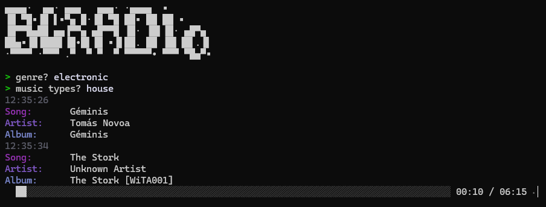

# BCRADIO
A command line music player for https://bandcamp.com, written in Rust.




### ⚠ About building and running on Linux 🐧

This program uses [rustaudio/cpal](https://github.com/rustaudio/cpal) lib to play audio, which requires ALSA development files on Linux.

In order to build and run this program on Linux, you need to install：

- `libasound2-dev` on Debian / Ubuntu
- `alsa-lib-devel` on Fedora

### ⚠ About running on Windows

The program can also play audio using the [ASIO4ALL](https://asio4all.org) driver instead of WASAPI.

## Usage

```
Usage: bcradio

Options:
  -h, --help     Print help
  -V, --version  Print version
  
[Key]                [Description]
 0-9                  adjust volume
 h                    print help
 s                    free word search
 f                    favorite search
 n                    play next
 p                    play / pause
 Q                    graceful kill
 Ctrl+C               exit
```
## License
The source code is licensed MIT. The website content is licensed CC BY 4.0,see LICENSE.

## Special Thanks

- [JasonWei512 / code-radio-cli](https://github.com/JasonWei512/code-radio-cli)
