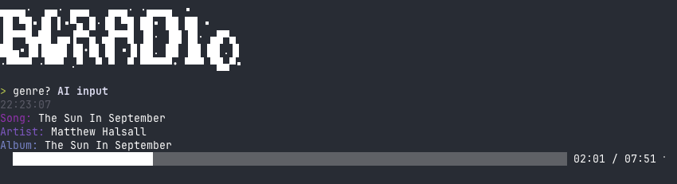
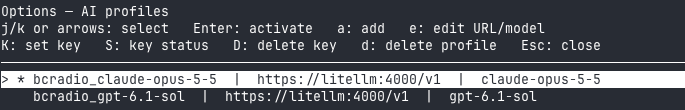

# BCRADIO
A command line music player for https://bandcamp.com, written in Rust.




## Usage

```
Usage: bcradio [OPTIONS] [COMMAND]

Commands:
  ai-key     Manage the AI API key in the OS credential store
  ai-config  Configure the OpenAI-compatible chat API
  help       Print this message or the help of the given subcommand(s)

Options:
  -v, --verbose... verbose log
  -n, --no-ssl-verify  disable SSL verification for Bandcamp requests
      --no-trim-leading-silence   preserve leading PCM silence
      --no-trim-trailing-silence  disable downloaded-buffer trailing PCM silence analysis/trimming
  -i, --img-width <IMG_WIDTH>  image size [default: 30]
  -h, --help       Print help
  -V, --version    Print version
  
[Key]                [Description]
 0-9                  adjust volume
 h                    help
 H                    playback history
 I                    generate AI playlist from a description
 O                    options / AI connection profiles
 i                    play info
 s                    free word search
 f                    favorite search
 n                    play next
 m                    menu
 l                    playlist (up:k, down:j, select:enter key)
 p                    play/pause
 Q                    finish the current song, then exit
 Esc                  cancel a pending Q and resume normal playback
 Ctrl+C               exit immediately
```

Logs are written as daily JSON files named `debug_bcradio.log.YYYY-MM-DD` in
the OS temporary directory (`$env:TEMP` on Windows). Use `-v`, `-vv`, or `-vvv`
for increasing verbosity; `RUST_LOG` overrides the default log filter.
`--no-ssl-verify` does not disable certificate verification for the AI API.

## Proxy configuration
All HTTP requests (Bandcamp and AI) use reqwest's default proxy settings:
`HTTP_PROXY`, `HTTPS_PROXY`, and `ALL_PROXY` (or their lowercase variants).
Use `NO_PROXY` (or `no_proxy`) to bypass the proxy for specific hosts, such as
a LiteLLM instance on the local network. Match the hostname used in the AI URL:

```
export ALL_PROXY=socks5h://proxy.internal:1080
export NO_PROXY=litellm.internal,localhost,127.0.0.1
bcradio
```

Use an `http://` or `https://` URL instead for an HTTP proxy.

The former `--proxy` option is no longer supported.

## AI API key storage

AI API keys are stored in the operating system's secure keychain / credential store,
not in a bcradio configuration file. Manage the key without exposing it in shell history:

```
bcradio ai-key set
bcradio ai-key status
bcradio ai-key delete
```

On macOS this uses Keychain, on Windows Credential Manager, and on Linux the
Secret Service (a running session service is required). If the store is unavailable,
bcradio reports an error rather than saving the key as plaintext. These commands
only manage the credential; use `I` during playback to generate a playlist.

## OpenAI-compatible API

Set the base URL (including `/v1` if your provider uses it) and model:

```
bcradio ai-config set --url https://api.openai.com/v1 --model YOUR_MODEL
bcradio ai-config set --url http://litellm.internal:4000/v1 --model YOUR_MODEL
bcradio ai-config show
```

The client sends chat completions to `<base URL>/chat/completions` with the
API key from the OS credential store. The non-secret URL and model are saved
to `~/Library/Application Support/bcradio/ai.json` on macOS,
`${XDG_CONFIG_HOME:-~/.config}/bcradio/ai.json` on Linux, or
`%APPDATA%\bcradio\ai.json` on Windows. No configuration directory is created
until a profile is saved with `ai-config set` or the `O` options screen.
HTTP is also supported for LiteLLM on another host; over HTTP, requests and
the API key are transmitted without encryption.

### Multiple AI connection profiles



Save a separate URL, model, and secure API key for each provider or model:

```sh
bcradio ai-config set --profile openai --url https://api.openai.com/v1 --model YOUR_MODEL
bcradio ai-key set --profile openai
bcradio ai-config set --profile litellm --url http://litellm.internal:4000/v1 --model YOUR_MODEL
bcradio ai-key set --profile litellm
bcradio ai-config list
bcradio ai-config use litellm
bcradio ai-config show
bcradio ai-key status --profile litellm
bcradio ai-key delete --profile litellm
bcradio ai-config delete litellm
```

Profile names contain 1–64 ASCII letters, digits, `.`, `_`, or `-` and are
case-sensitive. The first saved profile becomes active; adding another does
not switch it automatically. `ai-config set` / `show` and all `ai-key` commands
without `--profile` target the active profile, or `default` before initial
setup. The default key can still be registered before configuring its URL.
Named keys require a saved profile. `ai-config delete` removes both the profile
and its secure credential; deleting the active profile selects the first
remaining profile (or leaves none active).

During playback, press uppercase `O` to open the alternate-screen options view:

| Key | Action |
| --- | --- |
| `j` / `k`, arrows | Select a profile |
| Enter | Activate the selected profile |
| `a` | Add a profile (name, URL, model) |
| `e` | Edit the selected profile's URL and model |
| `K` | Register or replace its API key with hidden input |
| `S` | Check whether its API key is registered (never displays the key) |
| `D` | Delete its API key, with confirmation |
| `d` | Delete the profile and API key, with confirmation |
| Esc | Cancel a prompt or return to playback |

Switching applies to the next AI request, including automatic playlist
refills. It does not interrupt the current song, change generated tracks,
or modify a request already in progress. Add a profile first, then select it
and press `K` to register its key. Audio continues while the options view is open.

### Leading silence trimming

Leading silence is trimmed by default from decoded PCM, independently of MP3
gapless metadata. Start with `bcradio --no-trim-leading-silence` to disable it.
This setting is controlled only by startup arguments, not the `O` AI profiles
screen, and is not saved across restarts.

The detector removes only leading complete channel frames with amplitudes at
or below −80 dBFS, scanning at most 10 seconds. The first audible frame, silence
within the song, and trailing silence are preserved. Very quiet intros can still
be affected; disable trimming when preserving the original start is important.
Playback progress uses the PCM duration when known, falling back to the original
MP3 duration, minus the detected leading trim and any trailing cut;
track information and history retain the original duration. The detector is a
separate `Source` adapter: it requires neither seeking nor a complete-track PCM
buffer, but scans the prefix before playback begins.

### Trailing silence trimming (downloaded buffers)

Trailing trimming is also enabled by default. Use
`bcradio --no-trim-trailing-silence` to disable it independently of leading
trimming. Both trimming settings are controlled only by startup arguments and
remain unchanged during playback; they are not saved across restarts. To disable
both, start with
`bcradio --no-trim-leading-silence --no-trim-trailing-silence`.

After download, a background worker seeks near the end and decodes the tail
to PCM. It searches 3, 6, then at most 10 seconds back, using −80 dBFS and keeping
100 ms after the last sound. A single background preparation job owns the
unchanged MP3 buffer and prepares its decoder. Playback stops at the PCM marker before applying leading
trimming, so progress accounts for both cuts while metadata retains the original
duration. MP3 accurate seeking may scan compressed frame headers from the start;
it does not decode the whole song to PCM. Analysis adds startup work for the first
song and can run during playback for the next song. Fractional PCM durations are
read directly from Symphonia to avoid rodio 0.18.1's fractional-second conversion
bug when calculating markers and progress.

Unknown duration, failed seeks, PCM timeline mismatches, or no audible boundary
within the search limit leave the tail untouched. Entirely silent short tracks
are not given end markers. This analysis requires a downloaded, seekable buffer;
the separate end-marker playback adapter does not seek, but an unseekable live
stream would require a different tail detector.

```text
? describe an AI playlist to gpt-6.1 (Enter: generate, Esc: cancel)
```

Here `gpt-6.1` is the profile name, not necessarily the configured model name.
The profile name is not included in your description. URL, model, and API key
are not displayed in this input screen. If no profile is configured, the
prompt shows `not configured`; a settings read error shows `configuration unavailable`.

#### API keys when editing a model or URL

API keys belong to **profile names**, not model names. Editing a profile with
`e` (or updating it with `ai-config set`) keeps its existing API key. If you
change only the model and the same key can access that model, no key selection
or re-registration is needed.

If the new model requires a different key:

- To replace the key, select that profile and press `K`, or run
  `bcradio ai-key set --profile PROFILE_NAME`. This overwrites its previous key.
- To keep both model/key combinations, press `a` to create a separate profile,
  then select it and press `K` to register its key. Use Enter to activate the
  desired profile, for example:

  ```text
  litellm-model-a → model-A + API key A
  litellm-model-b → model-B + API key B
  ```

**Changing the URL also keeps the existing API key.** When moving to another
provider, create a separate profile or replace the key with `K` before making
an AI request, so the previous provider's key is not sent to the new endpoint.

Existing single-provider `ai.json` settings are read as the `default` profile,
and its existing keychain credential is reused without copying the key.
The configuration is converted to the profiles format on the next save;
merely reading settings does not create or rewrite files. Profile metadata
and the active selection are saved in the same `ai.json`; each profile's API
key stays exclusively in the OS credential store.

### AI usage cost (example)

The results below compare both models under the same conditions, using the
playlist description `しっとりjazz` (mellow jazz). Try different AI models and
find your favorite!

`openai/gpt-6.1-sol`:

| Metric | Value |
| --- |------------------------------------------------:|
| Tokens | 749 (167 prompt tokens + 582 completion tokens) |
| Reasoning tokens | 366 |
| Cost | $0.00477400 |
| AI API response time | 22.020 s |


`claude-opus-5-5`:

| Metric | Value |
| --- |------------------------------------------------:|
| Tokens | 999 (243 prompt tokens + 756 completion tokens) |
| Reasoning tokens | 617 |
| Cost | $0.01609200 |
| AI API response time | 13.084 s |


In other observed requests, AI responses took roughly 14 to 22 seconds.

Even for a short description, the AI request includes playlist instructions
and the artist names and titles of up to 30 songs played in the last 60 minutes.
On subsequent requests it also includes previously used search terms. The AI
is asked to avoid those songs and terms to reduce repeats, though this is not
guaranteed. These details also add to the prompt token count.

For each AI request, the model suggests 6 to 8 Bandcamp search terms rather
than tracks. bcradio searches for playable songs and adds up to 3 per term,
with a maximum of 15 tracks per request (not an average). Fewer tracks may
be added if searches fail, find no playable songs, or return duplicates.
If an exact artist-and-track search finds nothing, bcradio retries with a
shorter search term (such as `Portico Quartet Ruins` → `Portico Quartet`).
Tracks found through this fallback are only used if the artist matches the
shorter term.
Genre and mood are best-effort: bcradio does not classify the audio by genre or
mood (PCM analysis is only used for silence trimming), so a jazz
playlist may occasionally include a track that sounds more like hip-hop or
dance music.
Including the subsequent Bandcamp searches, creating a playlist typically
takes around 30 - 90 seconds; this can vary with AI response time and Bandcamp load.
When fewer than 2 tracks remain queued in an AI playlist, bcradio requests
more suggestions automatically; each additional AI request may incur a charge.

The cost above is for one observed request, not a fixed price per playlist.
Actual cost and response time depend on the provider, model, and request size;
check your provider's pricing and usage for current charges.

If you find a song you love, please support the artist on Bandcamp!

## ⚠ About building and running on Linux

This program uses [rustaudio/cpal](https://github.com/rustaudio/cpal) lib to play audio, which requires ALSA development files on Linux.

In order to build and run this program on Linux, you need to install：

- `libasound2-dev` on Debian / Ubuntu
- `alsa-lib-devel` on Fedora
- `alsa-lib`       on Alpine

If AAAA records are returned slowly in the information screen, add "options single-request-reopen" to resolve.conf. It is not my fault.

## ⚠ About running on Windows

The program can also play audio using the [ASIO4ALL](https://asio4all.org) driver instead of WASAPI.

Note: Windows is a pain to boot up, so I haven't done much software testing. Well, it will work.


## License
The source code is licensed MIT. The website content is licensed CC BY 4.0,see LICENSE.

## Special Thanks

- [JasonWei512 / code-radio-cli](https://github.com/JasonWei512/code-radio-cli)
